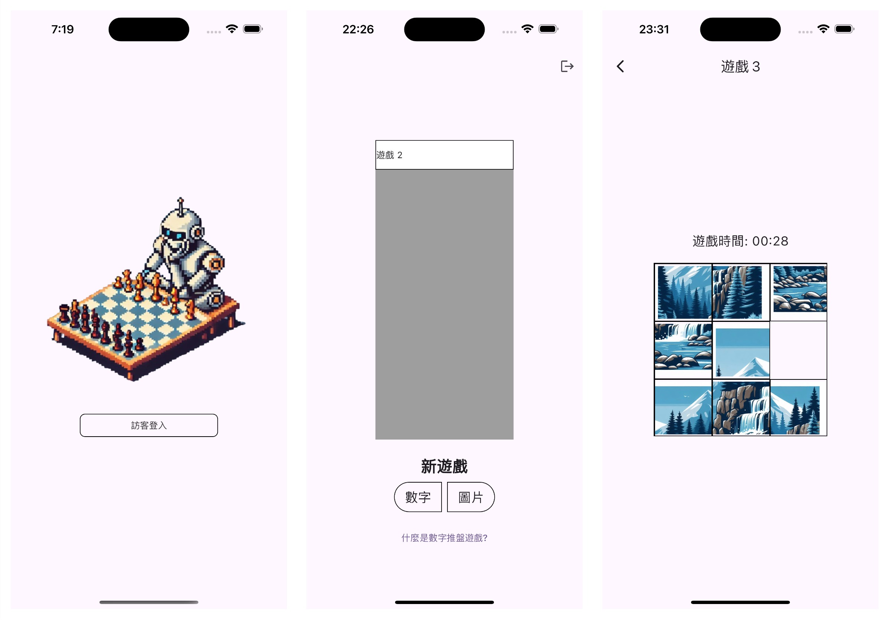

## Table of Contents
- [專案簡介](#專案簡介)
- [從這裡開始](#從這裡開始)
  - [環境設置](#環境設置)
  - [運行 App](#運行-app)
  - [執行測試](#執行測試)
- [專案架構](#專案架構)
- [聯絡作者](#聯絡作者)

## 🎲 專案簡介
這是一個 Number Puzzle 遊戲專案，玩家可以選擇遊玩 3x3 的數字拼圖或圖像拼圖。在數字拼圖中，玩家需要將 1 到 8 的數字排列整齊；在圖像拼圖中，玩家需要將被打亂的小塊拼回原圖，遊戲中每次挑戰開始時會自動計時。

## 📲 從這裡開始

### 環境設置
- 安裝 Flutter，可參考[這邊](https://docs.flutter.dev/get-started/install)
- 安裝 Firebase CLI，可參考[這邊](https://firebase.google.com/docs/cli?hl=zh-tw)

### 運行 App
- 啟動 Android / iOS 模擬器
- 啟動 Firebase Emulator
```shell
firebase emulators:start
```
- 執行
```sehll
flutter run
```

### 執行測試
- 單元測試與 Widget 測試
```shell
flutter test
```

- 執行整合 (請先啟動 Android 模擬器)
```shell
firebase emulators:exec --only auth 'flutter test integration_test'
```

## 🪜 專案架構


## 🛎️ 聯絡作者
- ✉️ easylive1989@gmail.com
- ✍️ [Medium](https://easylive1989.medium.com/)
- 💁‍ [LinkedIn]( https://www.linkedin.com/in/paul-wu-810280135/)